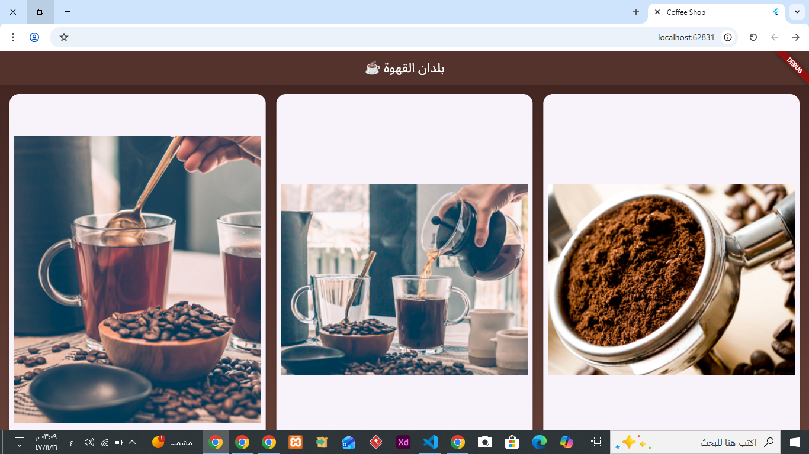
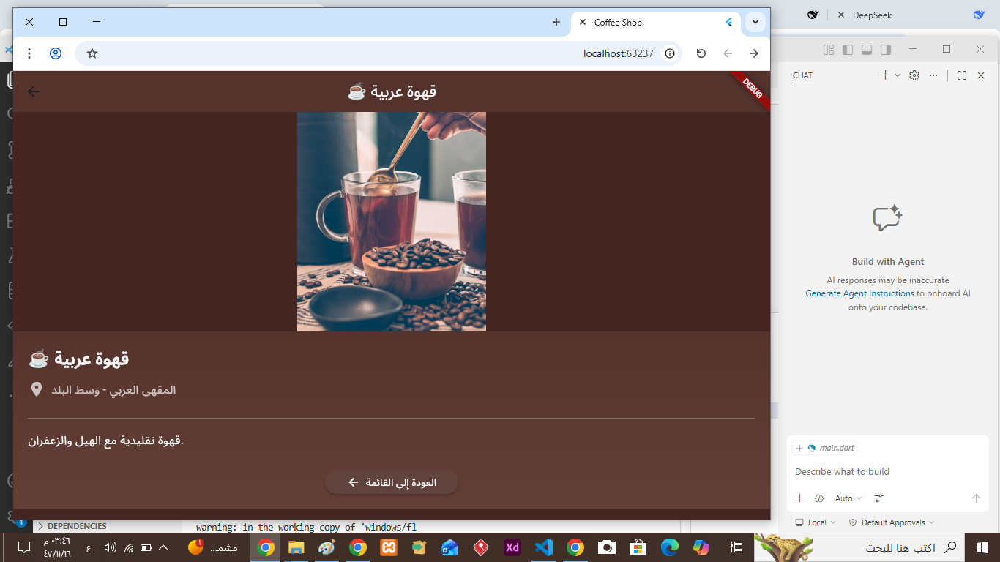

# ☕ Coffee Shop App - Basic Stack Navigation

A simple Flutter application that demonstrates stack navigation using `Navigator.push()` and `Navigator.pop()`.  
The app features a coffee shop theme with a beautiful gradient background.

---

## 📸 Screenshots

| Home Screen | Detail Screen |
|--------------|---------------|
|  |  |

---

## ✨ Features

- Two screens (Home + Details)
- Stack navigation using Navigator.push() and Navigator.pop()
- Coffee shop themed UI
- Dark brown / green gradient design
- Grid layout (3 columns)

---

## 🛠️ Technologies Used

- Flutter
- Dart
- Navigator (Stack Navigation)
- Git & GitHub

---

## 🚀 How to Run

```bash
flutter pub get
flutter run
